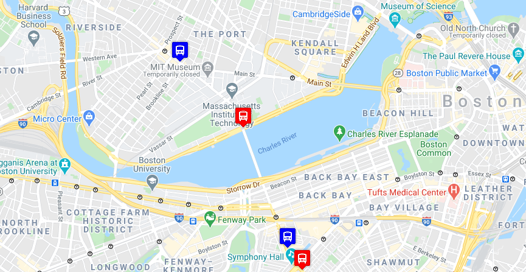

# Real-Time-Bus-Tracker

Track the "Real time" location of a random bus in Boston, Massachusetts. I used the Mapbox API to get the map, and I used MBTA's API to get the real time location of the public bus.

# Roadmap
In the future this will be improved to be a transportation app to make things as easy as possible for our community.

# Installation
To run this repo on your computer please follow these instructions:

1- Click **code**.

2- Copy the **repo's URL** using HTTPS or SSH key.

3- Open your terminal window.

4- Type git clone, and then paste the URL you copied earlier.

# Contribution
Feel free to make pull requests. For modification, please open an issue to discuss what you would like to change.

# License
<a href ="LICENCE">MIT<a>
